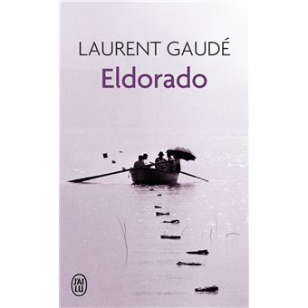

+++
title = "Eldorado"
date = "2024-01-11"
draft = false
pinned = false
+++
**L’auteur**

L’autre de livre Eldorado est Laurent Gaudé. Il est né à 6 juillet 1972 en Paris. Gaudé a étudié moderne, littérature et théâtre à l’université Paris. Il publie sa première pièce, qui est un théâtre : Onyos le furieux, en 1997. Son livre a des typiques marqués comme les thèmes de la guerre, de la mort ou de la violence et de la justice.

En 2002, il publie son premier roman : La Mort du roi Tsongor et à 2006 il publie le livre : Eldorado, ou il est présent. 

***La résumée :***

Dans cette livre, il s’agit d'un deux différentes histoires qui a connecté ensemble et a la fin cette histoire. Une histoire s’agit d'un commandant qui s’appelle Salvator Piracci, qui habite à Catane. Il est une officière de marine. Il surveille des illégaux immigrants qui arrivent à Lampedusa. La deuxième histoire s’agit du Soleiman et Jamal qui sont des frères qu’habitent en Afrique du Nord. Ils sont quittés ses vies en Afrique et aller à l’Europe. À l’Europe les deux différentes histoires couler ensemble et formulaire une histoire.

**Le jugement global**

La plupart des gens disent que le livre Eldorado couvre des sujets très importants. Par exemple le sujet de l’évasion. Cependant, il y a aussi de critique qu'on peut fait plus avec cette histoire.

**La recommandation du groupe**

Nous aussi pense que le roman traite de sujets actuels. Et on peut très bien sympathiser avec les personnages. Le livre est écrit, très passionnante, mais pas entièrement facile. Mais en tout, nous recommandons le livre !

**Une micro-analyse :**

 Le livre aborde la situation de nombreuses personnes qui fuient vers l'Europe en traversant la Méditerranée. Il est très pertinent de le lire en français, car il est en étroite corrélation avec la situation actuelle et historique. L'ouvrage est rédigé de manière captivante, bien que certains passages puissent être un peu exigeants.