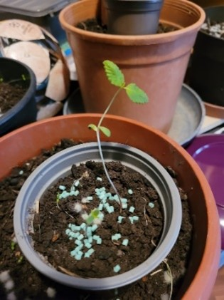
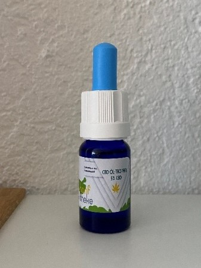

+++
title = "Kann Cannabis bei Rheumaschmerzen helfen?"
date = "2023-06-01"
draft = false
pinned = true
tags = ["Deutsch", "Reportage"]
image = "bild1.jpg"
description = "Hilft Cannabis wirklich gegen Rheumaschmerzen oder alles nur Einbildung?"
+++

# **Kann Cannabis bei Rheumaschmerzen helfen?**

*Mithilfe von Cannabis lassen sich mutmasslich Krankheiten therapieren, gegen die viele andere Medikamente nutzlos sind. Doch hilft diese Therapie wirklich? Und was sollte man über eine Cannabis-Therapie wissen?*

**Von Lara Aeberhard und Alina Reber**

Monika, Ende 40, leidet schon seit mehr als 15 Jahren an Rückenschmerzen. Sie ging von Arzt zu Arzt, doch niemand konnte ihr sagen, was es genau für Rückenschmerzen sind. Nach einigen Jahren wurde bei ihr die Diagnose *Rheuma im Bereich des Rückens* festgestellt, eine Entzündung der Wirbelsäulengelenke. Doch trotz Unmengen an Medikamenten verbesserten sich die Schmerzen nicht. Schlussendlich versuchte sie es mit CBD-Tropfen in der Hoffnung, dass die Schmerzen endlich gelindert werden können.

> “Ich hatte weder Wirkungen noch Nebenwirkungen!” 

Monika erklärte, dass sie schon allerlei Medikamente gegen ihre Rheumaschmerzen ausprobiert habe, unter anderem Opiate und sogar Spritzen vom Rheumatologen. All diese Medikamente brachten ihr jedoch keinen grossen Nutzen. Und zusätzlich verspürte sie auch diverse Nebenwirkungen.

Sie berichtete, dass sie in einem Zeitungsartikel gelesen hat, dass CBD-Tropfen vielen Menschen einen Nutzen brachten. Nachdem sie das gelesen hatte, entschied sie sich sofort, diese auszuprobieren. Sie hatte keine Angst davor diese auszuprobieren, denn sie dachte, es könne ja nur besser werden, als mit den anderen Medikamenten. Also begann sie die CBD-Tropfen voller Erwartungen zu sich zu nehmen und stellte dann aber relativ enttäuscht fest, dass sie höchstens eine leichte Müdigkeit verspürte.  

> “Ich hätte daran geglaubt!”

#### **Wie gut ist Cannabis im medizinischen Bereich erforscht?**

Hanf ist eine der bestuntersuchten Pflanzen der Welt. Auch über Cannabis als Heilmittel und über die Wirksamkeit der Cannabinoide, insbesondere über THC und in letzter Zeit auch zunehmend CBD, ist viel veröffentlicht worden. Sowohl THC- als auch CBD-haltige Cannabispräparate gelten, laut dem aktuellen Wissensstand, als sehr sicher und es gibt kaum andere Arzneimittel wie Cannabispräparate, bei denen die Arzneimittelsicherheit so gut dokumentiert ist.

Die wohl bekannteste Apotheke, in der man Cannabispräparate kaufen kann, ist die Apotheke in Langnau I.E. Auch Monika hat ihre CBD-Tropfen von dieser Apotheke erhalten. In der Cannaplant-Abteilung arbeiten Apotheker, welche spezialisiert sind im Bereich Cannabis. Wir durften mit dem Apotheker Herrn Andreas Robbi ein kurzes Interview führen. Er erzählte, dass sie sehr viele Patienten in ihrer Apotheke haben, welche Cannabispräparate als Medikament konsumieren, z. T. sind es auch Präparate mit einem höheren THC-Anteil und es vielen auch wirklich hilft. Welche Cannabispräparat bei welchen Patienten angewendet werden, wird vor der Abgabe mit dem zuständigen Arzt besprochen. Herr Robbi erklärte, dass die Präparate alle ähnlich wirken und man nicht direkt sagen kann, dass genau dieses eine Präparat für Rheumaschmerzen am besten wirkt. Es kommt immer auf den Patienten an, es kann sein, dass der Patient keine Wirkungen bei diesem Präparat verspürt, aber bei einem andern schon. Wichtig sei vor allem die Dosierung der Medikamente, welche auch von Patient zu Patient unterschiedlich ist.

> “Start slow, go slow, stay low.”

Herr Robbi erzählte auch, warum sich diese Art von Medikament immer mehr ausprägt in unserer Gesellschaft und auch, dass er es sehr positiv sieht. Denn man verbindet Cannabis immer weniger mit einer Droge und man müsse auch keine Angst haben, denn der Unterschied vom Cannabis als Medikament und Cannabis als Droge ist gross. Bei den Cannabispräparaten reicht eine bestimmte Dossierung, man strebt nicht nach dem Verlangen mehr zu konsumieren im Vergleich zu Opiaten, dort ist es häufig der Fall, dass man immer eine höhere Dosierung haben möchte und immer mehr einnehmen muss um den gewünschten Effekt zu erzielen.

> “Wenn ich eine solche Krankheit hätte, irgendwelche Schmerzen oder solche Geschichten, ich würde sicher immer zuerst mit irgendeinem Cannabinoide oder so probieren, bevor ich mir irgendein Opium, Morphin oder Oxytonon verschreiben lassen würde, das ist für mich eigentlich sonnenklar.“

#### **Das Ansehen von Cannabis in der Medizin**

Cannabis hat in den letzten Jahren ein sehr grosses Ansehen gewonnen. Jedoch gehen die Meinungen zum Cannabis-Konsum, sowohl als Droge und auch als Heilmittel sehr stark auseinander. Heute macht man die Entdeckung, dass vor allem junge Menschen dem Thema weniger kritisch entgegenstehen. Sicherlich gibt es auch einige Ausnahmen. Es gibt mit Sicherheit noch viele Menschen, die in Cannabis nur die "Droge" sehen und vielleicht auch einfach etwas Angst davor haben, Cannabis als Medizin auszuprobieren. Beispielsweise erzählte ein etwas älterer Herr von seinem Sohn, der abhängig von Cannabis (THC-haltiger Cannabis) wurde und so schlussendlich sogar in einer Klinik eintreten musste. Jedoch ist es wichtig, zwischen dem THC-haltigen Cannabis und den häufig verwendeten CBD-Tropfen zu unterscheiden. Heutzutage ist es jedoch erstaunlich, wie viele Menschen Cannabis als Heilmittel verwenden. Sehr wahrscheinlich wird es noch eine gewisse Zeit dauern, bis Cannabis vollständig als Heilmittel anerkennt wird.

#### **Wie unterscheidet sich die Wirkung von Cannabis als Medikament zu Cannabis als Droge?**

Herr Robbi verdeutlichte, dass die Pharmakokinetik, genauer gesagt die Verteilung eines Wirkstoffes in unserem Körper, beim Kiffen eines Joints und bei der Einnahme von Cannabistropfen nicht die gleiche sei. Beim Kiffen steigt die Konzentration sofort von 0 auf 100 und flacht nach ein paar Stunden wieder ab, bis man schlussendlich nach 3-4 Stunden fast nichts mehr spürt. Wenn man Cannabistropfen, eine Tinktur oder das Öl verwendet, fängt die Wirkung erst nach ca. einer Stunde langsam an und wirkt 3-4 Stunden, dementsprechend sind die Konzentrationen im Blut auch viel tiefer. Man geht davon aus, dass das Hirn vor allem durch diese hohen Peaks, wie beim Kiffen, geschädigt wird, da dort eine 350 bis 400-fach erhöhte Konzentration vorhanden ist im Vergleich zu der Tröpfchen Einnahme.

#### **Wie siehts mit Hanfblüten aus, welche nun zugelassen sind?**

Herr Robbi erläuterte, dass die Tröpfchen optimal sind bei chronischen Schmerzen, für Leute die täglich Schmerzen haben und Blüten wären dementsprechend gut für Schmerzspitzen oder Durchbruchschmerzen (akute Schmerzen), wie auch akute neuropathische Schmerzen (Nervenschmerzen), da die Blüten sehr schnell, kurz und stark wirken. Die Apotheke würde diese Blüten, dann aber nicht zum Rauchen empfehlen, sondern zum Inhalieren mit speziellen Inhalationsgeräten (Storz & Bickel). Diese werden noch geprüft und wenn sie zugelassen werden, könnten sie eventuell auch von der Krankenkasse übernommen werden.

**Wie sieht es mit der Krankenkasse aus, wer übernimmt die Kosten?**

Eine Cannabistherapie kostet zwischen 200 und 600 Franken pro Monat. Die Krankenkassen sind grundsätzlich nicht verpflichtet, die Kosten einer Cannabistherapie zu übernehmen, das heisst, dass der Patient die Kosten in der Regel selbst tragen muss. Es kann jedoch eine Kostengutsprache vom Arzt beantragt werden, welche dann dazu führt, dass der Patient nicht alles selbst bezahlen muss. Wie oben erwähnt könnte es sein, dass in der Zukunft vielleicht die Kosten des Inhalierens von Hanfblüten übernommen werden.

Bevor man sich dazu entscheidet Cannabispräparate zu konsumieren sollte man sich informieren lassen, was in Cannabispräparaten enthalten ist und wie diese Stoffe auf unseren Körper wirken. Wichtig ist auch, dass man sich bewusst ist, welche Nebenwirkungen auftreten können.

#### **Was ist in den Cannabispräparaten enthalten, welche Wirkung haben diese Inhalte?**

Der Hauptwirkstoff von Cannabis ist das Delta­9Tetrahydrocannabinol (THC oder auch Dronabinol genannt). THC wirkt schmerzlindernd, krampflösend, gegen Übelkeit und appetitsteigernd. THC wirkt über eine Bindung an spezifische Cannabinoid-Rezeptoren des Endo Cannabinoid-Systems. Das Endo Cannabinoid-System ist ein Teil des Nervensystems und spielt bei vielen Körperfunktionen eine wichtige Rolle.

#### **Welche Nebenwirkungen können CBD-Tropfen erzeugen?**

Es können, wie bei jedem Medikament, auch hier, bei CBD-Tropfen, leider unerwünschte Nebenwirkungen erscheinen. Glücklicherweise sind die Nebenwirkungen von CBD eher schwach und kommen nicht besonders häufig vor. Wahrscheinlicher sind stärkere Nebenwirkungen bei einer zu hohen Dosis der CBD-Tropfen oder bei der Einnahme gemeinsam mit anderen Arzneimitteln. Es kann aber auch sein, dass die Einnahme mit anderen Arzneimitteln, vor allem mit Opiaten einen positiven Effekt bewirken kann. Die bekannten Nebenwirkungen sind Müdigkeit, niedriger Blutdruck, Mundtrockenheit, Übelkeit, Erbrechen, Appetitlosigkeit, Durchfall und auch ein Ausschlag kann möglich sein. Diese vorher aufgezählten Nebenwirkungen sind kurzfristige Nebenwirkungen. Bedauerlicherweise kann es auch noch zu langfristigen Nebenwirkungen kommen. Diese langfristigen Nebenwirkungen können z.B. eine Gewichtszunahme oder ein Gewichtsverlust sein. Es kann auch sein, dass das Immunsystem durch CBD-Tropfen geschwächt wird und man sich so schneller mit Krankheiten infiziert. Zusätzlich können auch abweichenden Nierenwerte auftreten. Auch mit Müdigkeit und Schwäche, muss man eventuell bei den langfristigen Nebenwirkungen rechnen.

#### **Cannabis könnte in der Zukunft immer wichtiger werden in der Medizin und eine gute Alternative zu abhängig machenden Medikamenten sein**

Es ist sehr wichtig, dass unsere Gesellschaft eine andere Sicht auf Cannabis (in der Medizin) bekommt. Man sollte den Menschen zeigen, dass Cannabis auch noch etwas anderes sein kann, als eine «Droge» und dass man zwischen dem medizinischen Gebrauch und dem Gebrauch von Cannabis als Droge definitiv unterscheiden muss. Denn Cannabis, besonders CBD, hat, wie auch Herr Robbi erklärte, sicherlich schon vielen Menschen bei den unterschiedlichsten Problemen geholfen. Wie auch hier zu sehen, sollt man definitiv Cannabis mehr in der Medizin verwenden. Für die Menschen, welche Zweifel an Cannabis in der Medizin haben, sollten sich den Fakten bewusst werden und merken, dass es nicht wirklich mehr Sorgen gibt als bei einem normalen Medikament. Natürlich kann man nicht darauf vertrauen, dass beispielsweise CBD-Tropfen bei jeder Person gleich oder überhaupt wirken. Jedoch ist es mit Sicherheit einen Versuch wert, es zuerst mit CBD, anstatt mit konventionellen oder auch chemischen Medikamenten, die teils auch sehr starke Nebenwirkungen haben können, zu probieren. Diese Informationen sollen einigen Menschen bei der Entscheidung, ob sie medizinische Cannabispräparate verwenden wollen oder nicht helfen.